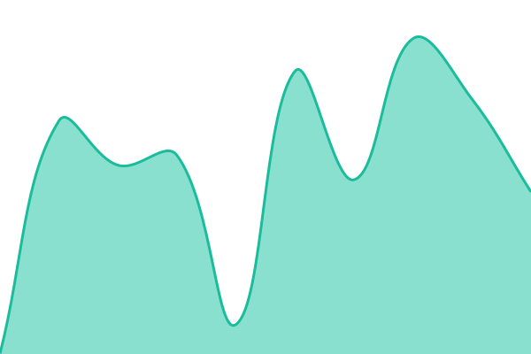
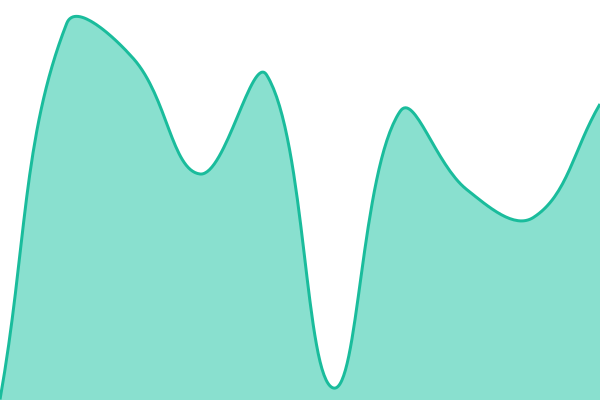

# [📈 Live Status](https://zakarias666.github.io/status): <!--live status--> **🟩 All systems operational**

This repository contains the open-source uptime monitor and status page for [Zakarias Broberg-Jepsen](https://zakarias666.github.io/status), powered by [Upptime](https://github.com/upptime/upptime).

With [Upptime](https://upptime.js.org), you can get your own unlimited and free uptime monitor and status page, powered entirely by a GitHub repository. We use [Issues](https://github.com/zakarias666/status/issues) as incident reports, [Actions](https://github.com/zakarias666/status/actions) as uptime monitors, and [Pages](https://zakarias666.github.io/status) for the status page.

<!--start: status pages-->
<!-- This summary is generated by Upptime (https://github.com/upptime/upptime) -->
<!-- Do not edit this manually, your changes will be overwritten -->
<!-- prettier-ignore -->
| URL | Status | History | Response Time | Uptime |
| --- | ------ | ------- | ------------- | ------ |
|  [API](https://api.zbj.dk/v1/health/) | 🟩 Up | [api.yml](https://github.com/zakarias666/status/commits/HEAD/history/api.yml) | 

 537ms
     
 | 

<a href="https://zakarias666.github.io/status/history/api">93.64%</a>
    

|  [Cloud](https://cloud.zbj.dk/status.php) | 🟩 Up | [cloud.yml](https://github.com/zakarias666/status/commits/HEAD/history/cloud.yml) | 

 503ms
     
 | 

<a href="https://zakarias666.github.io/status/history/cloud">96.74%</a>
    

|  [CDN](https://cdn.zbj.dk/) | 🟩 Up | [cdn.yml](https://github.com/zakarias666/status/commits/HEAD/history/cdn.yml) | 

 497ms
     
 | 

<a href="https://zakarias666.github.io/status/history/cdn">96.75%</a>
    

|  [Dev](https://dev.zbj.dk/) | 🟩 Up | [dev.yml](https://github.com/zakarias666/status/commits/HEAD/history/dev.yml) | 

 443ms
     
 | 

<a href="https://zakarias666.github.io/status/history/dev">96.75%</a>
    

|  [Test](https://test.zbj.dk/) | 🟩 Up | [test.yml](https://github.com/zakarias666/status/commits/HEAD/history/test.yml) | 

 484ms
     
 | 

<a href="https://zakarias666.github.io/status/history/test">96.75%</a>
    

<!--end: status pages-->

[**Visit our status website →**](https://zakarias666.github.io/status)

## 📄 License

- Powered by: [Upptime](https://github.com/upptime/upptime)
- Code: [MIT](./LICENSE) © [Anand Chowdhary](https://anandchowdhary.com)
- Data in the `./history` directory: [Open Database License](https://opendatacommons.org/licenses/odbl/1-0/)
